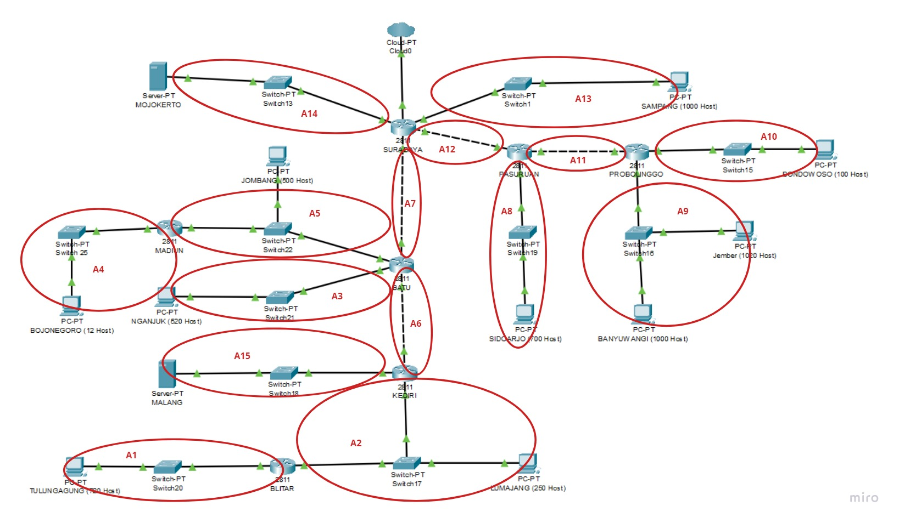
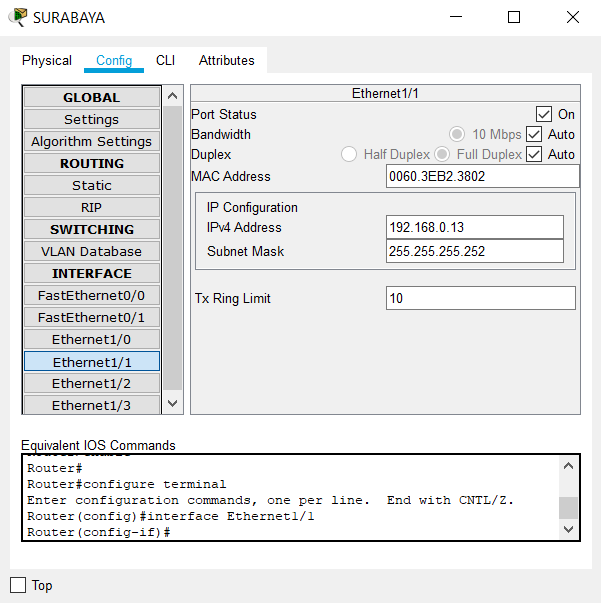
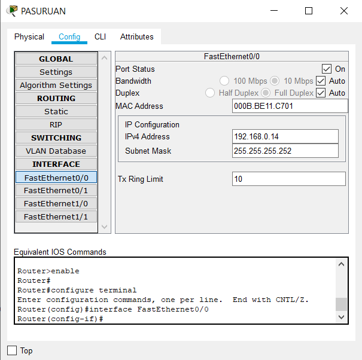
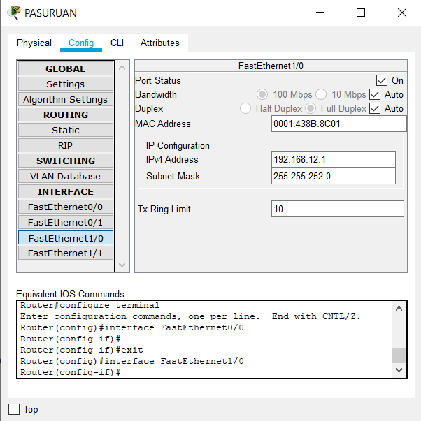
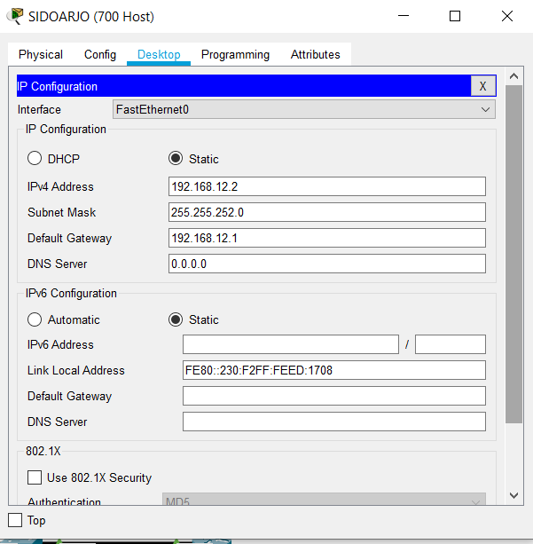

# Jarkom_Modul4_Lapres_T8
## Anggota Kelompok:
1. Kadek Nesya Kurniadewi (05311840000009)
2. Agung Mulyono (05311840000035)

### Topologi Jaringan


### Metode VLSM
**Langkah-langkah:**
+ Pertama membuat topologi seperti pada gambar diatas pada Cisco Packet Tracer (CPT)
+ Kemudian tambahkan port **NM-2FE2W** pada semua router kecuali **SURABAYA**. untuk router **SURABAYA** tambahkan port **NM-4E**
+ Sambungkan kabel pada tiap device
+ Lalu kelompokkan device menggunakan metode **VLSM**<br>

+ Setelah dikelompokkan, hitung jumlah total client yang dibutuhkan dan berdasarkan jumlah tersebut tentukan subnet yang diperlukan <br>

**Khusus untuk pembagian IP Pada Server menggunakan IP DMZ**

+ Atur IP untuk masing-masing interface yang ada di setiap device sesuai dengan pembagian subnet pada VLSM. Interface dapat diatur pada menu Config -> Interface > “nama interface” (contoh: FastEthernet0/0). Kemudian, isi alamat IP dan subnet mask dari subnet interface tersebut. Berikut contoh untuk mengatur IP pada subnet A8.
+ Atur IP pada interface **SURABAYA** yang mengarah ke **PASURUAN** dengan **192.168.0.13**<br>

+ Atur IP pada interface **PASURUAN** yang mengarah ke **SURABAYA** dengan **192.168.0.14**<br>

+ Atur IP pada subnet A8. Atur IP pada interface **PASURUAN** yang mengarah ke *client* dengan **192.168.12.1**<br>

+ Kemudian atur IP pada *client*<br>

`Catatan: Lakukan hal yang sama pada setiap device`
+ Lakukan routing agar semua device dapat terhubung
+ Routing pada **SURABAYA** yang mengarah ke subnet A8<br>

+ Routing pada **PASURUAN** yang mengarah ke **SURABAYA**<br>

+ Berikut adalah IP yang diperlukan pada device-device tertentu
  + Pada SURABAYA
    ```
    Network 192.168.12.0 Netmask 255.255.252.0 Next Hop 192.168.0.14
    ```
  + Pada PASURUAN
    ```
    ```
  + Pada BATU
    ```
    ```
  + Pada KEDIRI
    ```
    ```
